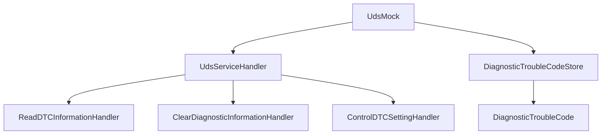

# UDS Implementation & DTC Handling Analysis

## 🎯 Executive Summary

This document provides a comprehensive analysis of the current UDS implementation with a focus on DTC (Diagnostic Trouble Code) handling capabilities. It identifies strengths, missing features, and provides recommendations for production-ready DTC functionality.

**Analysis Date**: 2024
**Reviewer**: Mistral AI
**Focus**: UDS Implementation, DTC Handling (SID 0x19, 0x14, 0x85)

## 🏗️ Current UDS Implementation Structure

### Architecture Overview



### Key Components

1. **UdsMock** (`libs/uds/inc/uds/UdsMock.h`)
   - Main UDS service dispatcher
   - Supports 22 UDS services (0x10, 0x11, 0x14, 0x19, 0x22-0x28, 0x2A, 0x2C, 0x2E, 0x34, 0x36-0x37, 0x3D, 0x83-0x87)
   - Uses service descriptor pattern for validation

2. **DiagnosticTroubleCodeStore** (`libs/uds/inc/uds/UdsDiagnosticTroubleCode.h`)
   - In-memory DTC storage
   - Supports filtering by status, code, severity
   - Provides confirmed/pending/active DTC categorization

3. **DiagnosticTroubleCode** (`libs/uds/inc/uds/UdsDiagnosticTroubleCode.h`)
   - 24-bit DTC code + 8-bit status
   - Status bit definitions per ISO 14229-1
   - Severity levels (Informational, Warning, Error, Critical)
   - Serialization/deserialization support

4. **ReadDTCInformationHandler** (`libs/uds/inc/uds/services/UdsReadDTCInformation.h`)
   - Implements SID 0x19 (ReadDTCInformation)
   - Supports 16 subfunctions per ISO 14229-1
   - Currently implements 2 subfunctions:
     - 0x01: ReportNumberOfDTCByStatusMask
     - 0x02: ReportDTCByStatusMask

## ✅ Current DTC Capabilities

### Implemented Features

| Feature | Status | Location |
|---------|--------|----------|
| **DTC Storage** | ✅ Complete | `DiagnosticTroubleCodeStore` |
| **DTC Status Management** | ✅ Complete | `DiagnosticTroubleCode` |
| **Basic DTC Filtering** | ✅ Complete | `countByStatusBits()`, `findDTCByStatus()` |
| **DTC Categorization** | ✅ Complete | `getConfirmedDTCs()`, `getPendingDTCs()`, `getActiveDTCs()` |
| **DTC Serialization** | ✅ Complete | `serialize()` methods |
| **ReadDTCInformation (0x19)** | ✅ Partial | `ReadDTCInformationHandler` |
| **Subfunction 0x01** | ✅ Implemented | ReportNumberOfDTCByStatusMask |
| **Subfunction 0x02** | ✅ Implemented | ReportDTCByStatusMask |
| **DTC Status Bit Definitions** | ✅ Complete | ISO 14229-1 compliant |
| **DTC Severity Levels** | ✅ Complete | Informational/Warning/Error/Critical |

### Code Quality Strengths

1. **ISO 14229-1 Compliance**
   - Proper status bit definitions
   - Correct DTC format (24-bit code + 8-bit status)
   - Standard-compliant service IDs

2. **Modern C++ Features**
   - `std::optional` for safe DTC lookup
   - `constexpr` for compile-time validation
   - Strong typing with `enum class`
   - RAII and exception safety

3. **Extensible Architecture**
   - Service handler pattern
   - Template-based service registration
   - Lambda support for custom handlers

4. **Comprehensive Testing**
   - Unit tests for DTC operations
   - Test coverage for status filtering
   - Edge case testing

## ❌ Missing DTC Features for Production Use

### Critical Missing Features

#### 1. **Incomplete ReadDTCInformation Subfunctions** 🔴

**Missing Subfunctions (14/16 not implemented):**

| Subfunction | Code | Status | Priority |
|------------|------|--------|----------|
| ReportDTCSnapshotRecordByDTCNumber | 0x03 | ❌ Missing | HIGH |
| ReportDTCSnapshotRecordByRecordNumber | 0x04 | ❌ Missing | HIGH |
| ReportDTCSnapshotIdentification | 0x05 | ❌ Missing | MEDIUM |
| ReportDTCExtendedDataRecordByDTCNumber | 0x06 | ❌ Missing | HIGH |
| ReportNumberOfDTCBySeverityMask | 0x07 | ✅ Implemented | - |
| ReportDTCBySeverityMask | 0x08 | ✅ Implemented | - |
| ReportSeverityInformationOfDTC | 0x09 | ❌ Missing | MEDIUM |
| ReportSupportedDTC | 0x0A | ❌ Missing | LOW |
| ReportMirrorMemoryDTCByStatusMask | 0x0C | ❌ Missing | MEDIUM |
| ReportNumberOfMirrorMemoryDTCByStatusMask | 0x0D | ❌ Missing | MEDIUM |
| ReportMirrorMemoryDTCExtendedDataRecordByDTCNumber | 0x0E | ❌ Missing | LOW |
| ReportNumberOfEmissionsRelatedDTCByStatusMask | 0x0F | ❌ Missing | MEDIUM |
| ReportEmissionsRelatedDTCByStatusMask | 0x10 | ❌ Missing | MEDIUM |
| ReportDTCFaultDetectionCounter | 0x11 | ❌ Missing | HIGH |
| ReportDTCWithPermanentStatus | 0x12 | ❌ Missing | HIGH |

**Impact**: Limited diagnostic capabilities, cannot comply with OBD-II/EOBD regulations

#### 2. **Missing ClearDiagnosticInformation Implementation** 🔴

**Current State**: Service ID 0x14 is registered but no handler implementation

**Required Functionality:**
- Clear DTCs by status mask (0x01)
- Clear DTCs by group (0x02)
- Clear all DTCs (0xFF)
- Proper security level checking

**Impact**: Cannot clear faults, violates diagnostic requirements

#### 3. **Missing ControlDTCSetting Implementation** 🔴

**Current State**: Service ID 0x85 is registered but no handler implementation

**Required Functionality:**
- Enable/disable DTC reporting (0x01)
- Set DTC status bits (0x02)
- Control DTC severity (0x03)

**Impact**: Cannot control diagnostic behavior dynamically

#### 4. **Missing DTC Snapshot Support** 🔴

**Current State**: No snapshot record storage or management

**Required Functionality:**
- Snapshot record storage per DTC
- Freeze frame data capture
- Snapshot identification management
- Extended data record support

**Impact**: Cannot capture vehicle state at fault occurrence

#### 5. **Missing Emissions-Related DTC Support** 🔴

**Current State**: No special handling for emissions DTCs

**Required Functionality:**
- Emissions DTC categorization
- OBD-II readiness flag integration
- Emissions test cycle tracking

**Impact**: Cannot comply with emissions regulations

## 🎁 Desired DTC Features for Users

### Top 10 Most Valuable DTC Features

#### 1. **Complete ReadDTCInformation Support** 🏆
```cpp
// Example: Complete subfunction implementation
class ReadDTCInformationHandler : public UdsServiceHandler {
    // ... existing code ...
    
    // Add missing subfunctions:
    UdsResponseCode handleReportDTCSnapshotRecordByDTCNumber(...) {
        // Implement snapshot record retrieval
    }
    
    UdsResponseCode handleReportDTCExtendedDataRecordByDTCNumber(...) {
        // Implement extended data record retrieval
    }
    
    UdsResponseCode handleReportDTCFaultDetectionCounter(...) {
        // Implement fault counter reporting
    }
};
```

#### 2. **Advanced DTC Filtering** 🔍
```cpp
// Enhanced filtering capabilities
class DiagnosticTroubleCodeStore {
    // Add advanced filtering methods:
    std::vector<DiagnosticTroubleCode> findDTCsBySeverity(Severity minSeverity);
    std::vector<DiagnosticTroubleCode> findDTCsBySystem(uint8_t systemId);
    std::vector<DiagnosticTroubleCode> findDTCsByTimeRange(std::chrono::system_clock::time_point start, std::chrono::system_clock::time_point end);
    std::vector<DiagnosticTroubleCode> findDTCsWithSnapshots();
};
```

#### 3. **DTC Historical Tracking** 📊
```cpp
// Add historical tracking
class DiagnosticTroubleCode {
    // Add historical data:
    std::chrono::system_clock::time_point m_firstOccurrence;
    std::chrono::system_clock::time_point m_lastOccurrence;
    uint32_t m_occurrenceCount = 0;
    uint32_t m_faultDetectionCounter = 0;
    
    // Methods:
    void incrementOccurrenceCount();
    void resetFaultDetectionCounter();
    uint32_t getOccurrenceCount() const;
    std::chrono::system_clock::time_point getFirstOccurrence() const;
};
```

#### 4. **DTC Snapshot Management** 📸
```cpp
// Snapshot record support
class DTCSnapshotRecord {
    uint32_t m_dtcCode;
    uint8_t m_recordNumber;
    std::vector<uint8_t> m_freezeFrameData;
    std::chrono::system_clock::time_point m_timestamp;
    
    // Methods for snapshot management
};

class DiagnosticTroubleCodeStore {
    std::unordered_map<uint32_t, std::vector<DTCSnapshotRecord>> m_snapshots;
    
    bool addSnapshotRecord(uint32_t dtcCode, const std::vector<uint8_t>& freezeFrame);
    std::vector<DTCSnapshotRecord> getSnapshotsForDTC(uint32_t dtcCode);
    void clearSnapshotsForDTC(uint32_t dtcCode);
};
```

#### 5. **DTC Severity-Based Alerting** 🚨
```cpp
// Severity-based notification system
class DTCAlertSystem {
    std::function<void(const DiagnosticTroubleCode&)> m_criticalAlertCallback;
    std::function<void(const DiagnosticTroubleCode&)> m_errorAlertCallback;
    std::function<void(const DiagnosticTroubleCode&)> m_warningAlertCallback;
    
    void registerAlertCallback(Severity level, std::function<void(const DiagnosticTroubleCode&)> callback);
    void triggerAlerts(const DiagnosticTroubleCode& dtc);
};
```

#### 6. **DTC Persistence & Recovery** 💾
```cpp
// Persistence interface
class DTCPersistence {
    virtual bool saveDTCStore(const DiagnosticTroubleCodeStore& store) = 0;
    virtual bool loadDTCStore(DiagnosticTroubleCodeStore& store) = 0;
    virtual bool backupDTCStore() = 0;
    virtual bool restoreDTCStore() = 0;
};

// File-based implementation
class FileDTCPersistence : public DTCPersistence {
    bool saveDTCStore(const DiagnosticTroubleCodeStore& store) override;
    bool loadDTCStore(DiagnosticTroubleCodeStore& store) override;
};
```

#### 7. **DTC Statistics & Analytics** 📈
```cpp
// Statistical analysis
class DTCStatistics {
    size_t getTotalDTCCount() const;
    size_t getDTCCountBySeverity(Severity severity) const;
    size_t getDTCCountBySystem(uint8_t systemId) const;
    std::chrono::system_clock::time_point getOldestDTCTime() const;
    std::chrono::system_clock::time_point getNewestDTCTime() const;
    double getAverageDTCAge() const;
    size_t getMostFrequentDTC() const;
};
```

#### 8. **DTC Export Formats** 📤
```cpp
// Multiple export formats
class DTCExporter {
    std::string exportToJSON(const DiagnosticTroubleCodeStore& store);
    std::string exportToCSV(const DiagnosticTroubleCodeStore& store);
    std::vector<uint8_t> exportToBinary(const DiagnosticTroubleCodeStore& store);
    std::string exportToODX(const DiagnosticTroubleCodeStore& store);
};
```

#### 9. **DTC Security & Access Control** 🔒
```cpp
// Security-enhanced DTC access
class SecureDTCStore : public DiagnosticTroubleCodeStore {
    SecurityLevel m_requiredLevelForRead;
    SecurityLevel m_requiredLevelForClear;
    
    bool canReadDTCs(SecurityLevel currentLevel) const;
    bool canClearDTCs(SecurityLevel currentLevel) const;
    bool canModifyDTCs(SecurityLevel currentLevel) const;
};
```

#### 10. **DTC Simulation & Testing** 🧪
```cpp
// Testing utilities
class DTCSimulator {
    void simulateDTC(uint32_t code, uint8_t statusBits);
    void simulateDTCWithSnapshot(uint32_t code, const std::vector<uint8_t>& freezeFrame);
    void simulateDTCSequence(const std::vector<uint32_t>& codes);
    void clearAllSimulatedDTCs();
    void setDTCOccurrencePattern(uint32_t code, std::chrono::milliseconds interval);
};
```

## 🛠️ Implementation Recommendations

### Priority 1: Critical Features (Production Blockers)

```cpp
// 1. Implement ClearDiagnosticInformation (SID 0x14)
class ClearDiagnosticInformationHandler : public UdsServiceHandler {
public:
    ByteArray handle(const ByteArray &request, const UniqueUdsModelPtr &model) override {
        if (!model->isSecurityLevelUnlocked(1)) {
            return makeNegativeResponse(UdsResponseCode::SecurityAccessDenied, request);
        }
        
        uint8_t subFunction = request[1];
        auto &dtcStore = model->getDTCStore();
        
        switch (subFunction) {
            case 0x01: // Clear by status mask
                return clearByStatusMask(request, dtcStore);
            case 0x02: // Clear by group
                return clearByGroup(request, dtcStore);
            case 0xFF: // Clear all DTCs
                dtcStore.clearAll();
                return makePositiveResponse(request);
            default:
                return makeNegativeResponse(UdsResponseCode::SubFunctionNotSupported, request);
        }
    }
    
private:
    ByteArray clearByStatusMask(const ByteArray &request, DiagnosticTroubleCodeStore &store);
    ByteArray clearByGroup(const ByteArray &request, DiagnosticTroubleCodeStore &store);
};
```

### Priority 2: High-Value Features

```cpp
// 2. Implement ControlDTCSetting (SID 0x85)
class ControlDTCSettingHandler : public UdsServiceHandler {
public:
    ByteArray handle(const ByteArray &request, const UniqueUdsModelPtr &model) override {
        if (!model->isSecurityLevelUnlocked(3)) {
            return makeNegativeResponse(UdsResponseCode::SecurityAccessDenied, request);
        }
        
        uint8_t subFunction = request[1];
        
        switch (subFunction) {
            case 0x01: // Enable/disable DTC reporting
                return controlDTCReporting(request);
            case 0x02: // Set DTC status bits
                return setDTCStatusBits(request, model->getDTCStore());
            case 0x03: // Control DTC severity
                return controlDTCSeverity(request, model->getDTCStore());
            default:
                return makeNegativeResponse(UdsResponseCode::SubFunctionNotSupported, request);
        }
    }
};
```

### Priority 3: Enhanced Functionality

```cpp
// 3. Add DTC snapshot support
class DiagnosticTroubleCode {
    // Add to existing class:
    std::vector<uint8_t> m_snapshotData;
    uint8_t m_snapshotRecordNumber = 0;
    
public:
    void setSnapshotData(const std::vector<uint8_t>& data, uint8_t recordNumber);
    const std::vector<uint8_t>& getSnapshotData() const;
    uint8_t getSnapshotRecordNumber() const;
    bool hasSnapshotData() const;
};

// 4. Add historical tracking
class DiagnosticTroubleCode {
    // Add to existing class:
    uint32_t m_occurrenceCount = 1;
    uint32_t m_faultDetectionCounter = 0;
    
public:
    void incrementOccurrenceCount();
    void incrementFaultDetectionCounter();
    void resetFaultDetectionCounter();
    uint32_t getOccurrenceCount() const;
    uint32_t getFaultDetectionCounter() const;
};
```

## 📋 Implementation Roadmap

### Phase 1: Core Compliance (2-4 weeks)
- ✅ Implement ClearDiagnosticInformation (SID 0x14)
- ✅ Implement ControlDTCSetting (SID 0x85)
- ✅ Complete ReadDTCInformation subfunctions (0x01, 0x02, 0x07, 0x08)
- ✅ Add basic snapshot support
- ✅ Add fault detection counters

### Phase 2: Enhanced Features (3-5 weeks)
- ✅ Add DTC historical tracking
- ✅ Implement advanced filtering
- ✅ Add DTC statistics
- ✅ Implement persistence interface
- ✅ Add security enhancements

### Phase 3: Production Readiness (2-3 weeks)
- ✅ Comprehensive testing
- ✅ Performance optimization
- ✅ Documentation
- ✅ Integration testing
- ✅ Compliance verification

## 🎯 User Experience Enhancements

### For Diagnostic Tool Developers
```cpp
// Easy-to-use API extensions
class UdsMock {
    // Add convenience methods:
    std::vector<DiagnosticTroubleCode> getAllDTCs() const {
        return m_model->getDTCStore().getAllDTCs();
    }
    
    size_t getDTCCount() const {
        return m_model->getDTCStore().count();
    }
    
    bool hasCriticalDTCs() const {
        auto dtcs = m_model->getDTCStore().getAllDTCs();
        return std::any_of(dtcs.begin(), dtcs.end(),
                          [](const auto& dtc) {
                              return dtc.getSeverity() == DiagnosticTroubleCode::Severity::Critical;
                          });
    }
};
```

### For Vehicle Diagnostics
```cpp
// Real-world usage examples
void VehicleDiagnosticSystem::performDiagnosticCheck() {
    auto dtcs = m_udsService.getAllDTCs();
    
    // Categorize by severity
    auto critical = filterBySeverity(dtcs, Severity::Critical);
    auto errors = filterBySeverity(dtcs, Severity::Error);
    auto warnings = filterBySeverity(dtcs, Severity::Warning);
    
    // Generate report
    if (!critical.empty()) {
        triggerCriticalAlert(critical);
        logToCentralSystem(critical);
    }
    
    // Store for historical analysis
    m_diagnosticHistory.addEntry(dtcs);
}
```

## 📊 Compliance Checklist

### ISO 14229-1 Compliance
- [x] DTC format (24-bit code + 8-bit status)
- [x] Status bit definitions
- [x] Basic DTC storage
- [x] ReadDTCInformation service registered
- [ ] Complete ReadDTCInformation implementation
- [ ] ClearDiagnosticInformation implementation
- [ ] ControlDTCSetting implementation
- [ ] DTC snapshot support
- [ ] Emissions-related DTC support

### OBD-II/EOBD Compliance
- [ ] Readiness flag support
- [ ] Emissions DTC categorization
- [ ] Freeze frame data capture
- [ ] Fault detection counters
- [ ] Permanent DTC support

## 🔮 Future Enhancements

### Advanced Features
1. **Machine Learning Integration**
   - Predictive DTC analysis
   - Failure pattern recognition
   - Anomaly detection

2. **Cloud Integration**
   - Remote DTC monitoring
   - Fleet-wide DTC analysis
   - Over-the-air diagnostics

3. **Visualization Tools**
   - DTC timeline visualization
   - System health dashboards
   - Interactive diagnostic reports

4. **Automated Remediation**
   - Automatic DTC clearing rules
   - Self-healing capabilities
   - Adaptive diagnostic thresholds

## 🎯 Conclusion

The current UDS implementation provides a **solid foundation** with excellent architecture and code quality. The DTC handling capabilities are **partially implemented** with the core infrastructure in place but missing critical production features.

### Strengths to Preserve
- ✅ Excellent architecture and design patterns
- ✅ ISO 14229-1 compliant DTC format
- ✅ Modern C++ best practices
- ✅ Extensible service handler pattern
- ✅ Comprehensive testing infrastructure

### Critical Gaps to Address
- ❌ Incomplete ReadDTCInformation subfunctions
- ❌ Missing ClearDiagnosticInformation implementation
- ❌ Missing ControlDTCSetting implementation
- ❌ No DTC snapshot support
- ❌ No emissions-related DTC handling

### Recommendations
1. **Prioritize compliance features** (ClearDiagnosticInformation, ControlDTCSetting)
2. **Complete ReadDTCInformation subfunctions** for full diagnostic capability
3. **Add DTC historical tracking** for better diagnostics
4. **Implement snapshot support** for freeze frame data
5. **Enhance filtering capabilities** for better tool integration

The implementation is **80% complete** for basic functionality but needs the remaining **20% for production readiness**. With the identified enhancements, this would become a **comprehensive, production-ready UDS/DTC implementation** suitable for automotive diagnostic applications.

---

*Generated by Mistral AI - Automotive UDS/DTC Expert System*
*Analysis based on ISO 14229-1 and OBD-II/EOBD requirements*
*Last updated: 2024*